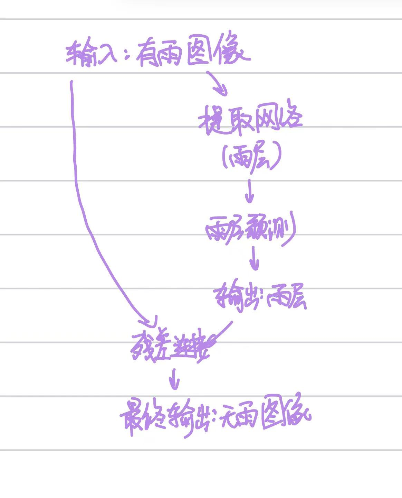

### 基础问题：

**学会从有雨图像到无雨图像的端到端映射**：

这个方法看似比较直接，但这样会有几个问题；一是由于模型学习的是整个画面，同时需要模型记住所有模型的内容，这样既会使得模型的训练难度较大，同时较难收敛，同时由于我们是直接训练得到结果，在没雨的地方内容也可能会发生改变，同时可能会带来很多的噪点。

**残差学习**：

残差学习相对而言只需要我们关注是否存在雨滴即可，这使得模型相对而言更加简单，同时也更容易收敛。这样我们只需要减去这层雨层，对其他地方图像的破坏就会较小。同时学习雨滴的样子而非场景也会带来更多的泛化能力，使得模型更容易推广到更多的场景。

**图像：**

### **附加问题**：

#### 1.雨丝这一物体，在外表上表现出的线性特征，其实也存在于其他物体中（如条纹、纹理等）。在面对这种情况时，**模型如何分辨谁是雨丝？**

其实这是可以区分的，就像我们人可以很明显的区分花纹和真正的雨滴，那么不就说明这两者在视觉上就是有本质区别的。具体而言：

**雨丝**：在整个图像中重复出现，方向分布随机但符合物理规律（透视效果），同时由于运动模糊和光反射，具有特定的亮度渐变和模糊边界

**花纹**：通常局限于特定物体表面（如衣服条纹、建筑纹理），且有清晰的边界和一致的对比度

#### 2.雨非常大时，密集的雨丝可能会完全遮挡住背景的一些细节（比如建筑的轮廓线）。在这种因干扰而难以分辨的情况下，**模型还有可能复原出原来的物体吗？**

我认为有可能，但如果遮挡的过于厉害，有可能也无法完全恢复。首先，我们可以通过海量的数据训练来获得图片的一些规律，比如建筑的轮廓与上下间的关系，建筑上有窗户等等，但如果遮挡关于严重或者该照片的模式我们没有训练，也可能导致信息无法完全修复。