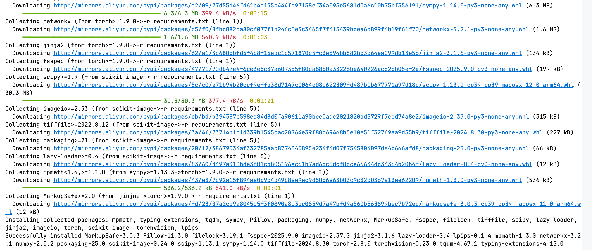
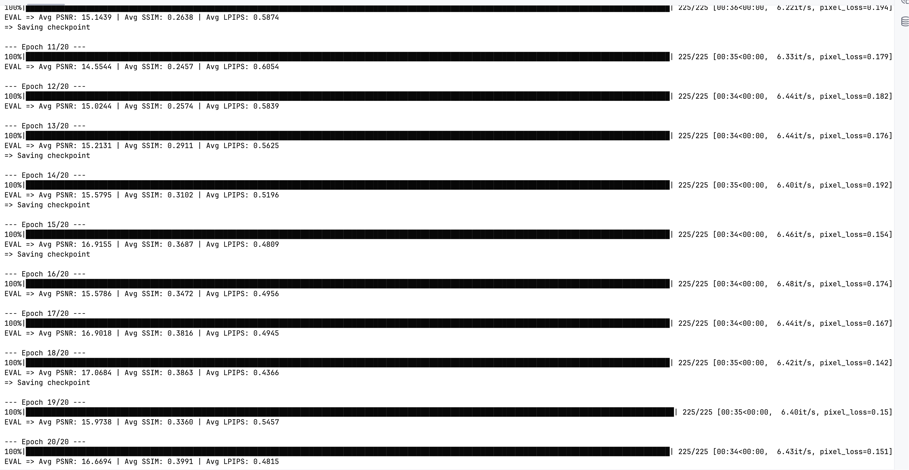
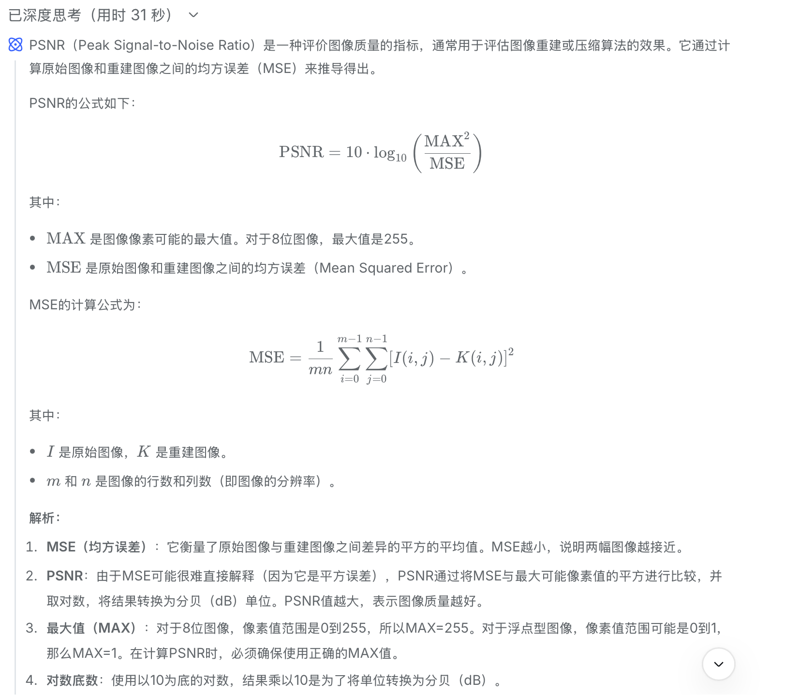

### 环境搭建：小菜一碟




###  实现一个简单的模型

#### 1.ResNet的构建

```python
import torch
import torch.nn as nn
import torch.nn.functional as F


class ResidualBlock(nn.Module):
    def __init__(self, in_channels=64, out_channels=64, stride=1):
        super(ResidualBlock, self).__init__()

        self.conv1 = nn.Conv2d(in_channels, out_channels, kernel_size=3,
                               stride=stride, padding=1, bias=False)
        self.bn1 = nn.BatchNorm2d(out_channels)

        self.conv2 = nn.Conv2d(out_channels, out_channels, kernel_size=3,
                               stride=1, padding=1, bias=False)
        self.bn2 = nn.BatchNorm2d(out_channels)
        self.shortcut = nn.Sequential()
    def forward(self, x):
        out = F.relu(self.bn1(self.conv1(x)))
        out = self.bn2(self.conv2(out))
        out += self.shortcut(x)
        out = F.relu(out)
        return out


class BaselineNet(nn.Module):
    def __init__(self, in_channels=3, out_channels=3, base_channels=64):
        super(BaselineNet, self).__init__()

        self.conv1 = nn.Conv2d(in_channels, base_channels, kernel_size=3,
                               stride=1, padding=1, bias=False)
        self.bn1 = nn.BatchNorm2d(base_channels)

        self.layer1 = ResidualBlock(base_channels, base_channels, stride=1)
        self.layer2 = ResidualBlock(base_channels, base_channels, stride=1)
        self.layer3 = ResidualBlock(base_channels, base_channels, stride=1)
        self.layer4 = ResidualBlock(base_channels, base_channels, stride=1)

        self.conv_final = nn.Conv2d(base_channels, out_channels, kernel_size=3,
                                    stride=1, padding=1)

        self._initialize_weights()

    def _initialize_weights(self):
        for m in self.modules():
            if isinstance(m, nn.Conv2d):
                nn.init.kaiming_normal_(m.weight, mode='fan_out', nonlinearity='relu')
            elif isinstance(m, nn.BatchNorm2d):
                nn.init.constant_(m.weight, 1)
                nn.init.constant_(m.bias, 0)

    def forward(self, x):
        identity = x

        out = F.relu(self.bn1(self.conv1(x)))
        out = self.layer1(out)
        out = self.layer2(out)
        out = self.layer3(out)
        out = self.layer4(out)
        out = self.conv_final(out)

        output = identity + out
        return output
```

#### 2.解决感受野受限的问题

让我们先来介绍几个概念。

##### 空洞卷积：

它通过在卷积核元素之间插入空格（空洞）来**扩大感受野**，同时**不增加参数数量**或**降低分辨率**。简单来说，它就是先通过加入0的方式扩大整个卷积核，但由于0的位置不改变整个结构，所以实际的卷积核的大小是不变的

##### 金字塔池化 ：

相比传统的池化，金字塔池化通过多个并行池化分支，由此可以捕获从精细到粗糙的多尺度信息，从而扩大了感受野并且在一定程度上有助于减小过拟合。

### 这个代码是什么意思？

#### 运行代码截图：



但我们注意到，此时的SSIM并不高，只有0.39左右，但同时我们注意到此时的loss已经稳定在0.15,甚至出现了一定的过拟合，这也为我们在下文留下了契机。

#### 学到的新东西：

Resnet的整体结构我在花卉那道题中基本已经阐述了，但这道题中学到的一个有趣的东西反而是下面的初始化的方式。

```python
def _initialize_weights(self):
    for m in self.modules():
        if isinstance(m, nn.Conv2d):
            nn.init.kaiming_normal_(m.weight, mode='fan_out', nonlinearity='relu')
        elif isinstance(m, nn.BatchNorm2d):
            nn.init.constant_(m.weight, 1)
            nn.init.constant_(m.bias, 0)
```

以前，我们初始化都是求合为0和方差为1来来初始化w，并直接将b赋值为0，这当然是对的。但在这里，我们使用使用 **Kaiming正态分布**来初始化权重。这是一种对于CNN更好的初始化方式。具体而言，其正态分布如下


相比于我们以前使用的状态分布，其最主要的区别就是它将方差从不变的1改变为一个与岑层数有关，这样使得网络结构（fan_in或fan_out）自动调整方差，使得每一层激活值的方差大致为1，从而保持信号在深层网络中的稳定流动。同时系数2是因为ReLU会将一半的输入置零，所以方差会减半，而我们可以通过乘2来补偿这一损失。

#### 附加：

对于手动实现，我们首先要了解PSNR的公式，这里我直接询问deepseek，得到了如下的结果。



故我们要遍历整个图片来计算MSE，同时在遍历的同时要寻找MAX，最终由第一个公式就可以计算PSNR。同时，我们主要到，如果我们对图片进行了归一化，那么此时max就应为1。

```python
def my_psnr(img1, img2):
    mse = np.mean((img1 - img2) ** 2)
    if img1.dtype == np.uint8:
        max = 255.0
    elif img1.max() <= 1.0 and img2.max() <= 1.0:
        max = 1.0
    else:
        max = max(np.max(img1), np.max(img2))
    psnr = 20 * math.log10(max / math.sqrt(mse))
    return psnr
```

