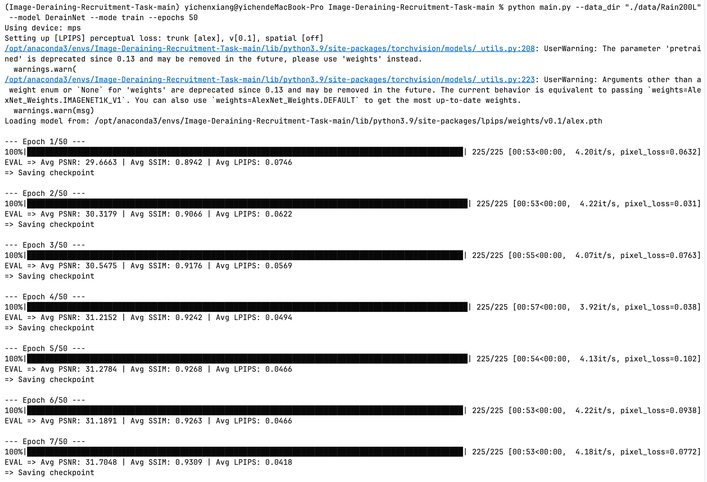
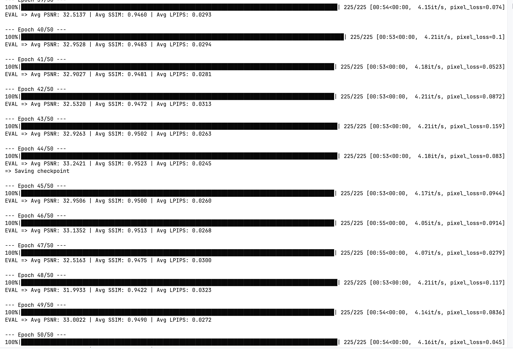

#### 1.代码：

```python
import torch
from torch import nn


class ResidualBlock(nn.Module):
    def __init__(self, channels):
        super(ResidualBlock, self).__init__()
        self.conv1 = nn.Conv2d(channels, channels, kernel_size=3, padding=1)
        self.relu = nn.ReLU(inplace=True)
        self.conv2 = nn.Conv2d(channels, channels, kernel_size=3, padding=1)

    def forward(self, x):
        residual = x
        out = self.relu(self.conv1(x))
        out = self.conv2(out)
        out += residual
        return out


class DerainNet(nn.Module):
    def __init__(self, in_channels=3, base_channels=64, num_blocks=8):
        super(DerainNet, self).__init__()
        self.initial_conv = nn.Conv2d(in_channels, base_channels, kernel_size=3, padding=1)

        self.branch_full = self.Blocks(base_channels, num_blocks)
        self.branch_half = self.Blocks(base_channels, num_blocks)
        self.branch_quarter = self.Blocks(base_channels, num_blocks)

        self.pool_half = nn.MaxPool2d(kernel_size=2, stride=2)
        self.pool_quarter = nn.MaxPool2d(kernel_size=4, stride=4)

        self.upsample_half = nn.Upsample(scale_factor=2, mode='bilinear', align_corners=False)
        self.upsample_quarter = nn.Upsample(scale_factor=4, mode='bilinear', align_corners=False)

        self.trans= nn.Sequential(
            nn.Conv2d(base_channels * 3, base_channels, kernel_size=3, padding=1),
            nn.ReLU(inplace=True),
            nn.Conv2d(base_channels, in_channels, kernel_size=3, padding=1)
        )

    def Blocks(self, channels, num_blocks):   #将前面我们写的8层残差块封装在一个函数中
        layers = []
        for _ in range(num_blocks):
            layers.append(ResidualBlock(channels))
        return nn.Sequential(*layers)

    def forward(self, x):
        x_initial = self.initial_conv(x)

        branch1_out = self.branch_full(x_initial) + x_initial

        x_half = self.pool_half(x_initial)
        branch2_out = self.branch_half(x_half) + x_half
        branch2_out = self.upsample_half(branch2_out)

        x_quarter = self.pool_quarter(x_initial)
        branch3_out = self.branch_quarter(x_quarter) + x_quarter
        branch3_out = self.upsample_quarter(branch3_out)

        concatenated = torch.cat([branch1_out, branch2_out, branch3_out], dim=1)
        rain_layer = self.trans(concatenated)
        deraining = x - rain_layer
        return deraining
```

#### 2.测试模型性能：





#### 3.思考：

##### 1.

下采样在上面的模型中就是池化，本质就是减少图像面积来获得更大的感受野，而上采样就是Upsimple（关于其的细节我写在了下面），其本质就是增加图像或特征图的空间尺寸，来获得更多的细节。

首先下采样的原因应该就是为了解决感受野的问题，下采样可以让图片获得更大的感受野的同时也就一定程度上减小了计算量，避免了梯度爆炸或者是梯度消失的可能。而上采样的原因我认为是为了保持图片大小的一致性，毕竟去雨任务的本质就是输出一个与原图片大小相同的新图片。同时也使得三者的图像可以拼接。这样分为三个尺度采样也使得模型可以对不同大小的雨分开处理。

Concat本质就是在特定的维度上组合张量的过程。具体来说，在上面的例子中，其就是沿着C这个维度组合张量，最后将其变为3C

##### 2.

**关于Upsimple：**

这个函数（方法）确实我是第一次听说，简单来说它是是 PyTorch 中用于上采样（放大）特征图的模块，可以将小尺寸的特征图放大到更大的尺寸。其实在我看来Upsimple与maxpool就是一对相对而言的方法，后者将图像压缩从而可以获得更大的感受野，后者将图片恢复到原有的大小来恢复图片的整体形状。

##### 一些小的思考（以下观点纯属个人猜测😊）：

其实我在研究这个方法的时候，我想到的是花卉那道题。在那道题目中，我们使用裁切的数据增强方式得到了3组图片，让后我把三组图片用torch.cat的方式扩大了3倍，然后代入训练，但后面我们也注意这样做会带来一定程度的过拟合。而我们裁切的主要目的不也是为了后去不同的大小（感受野），那我们用这个方法不是也可以使得花卉的训练效果更好。
