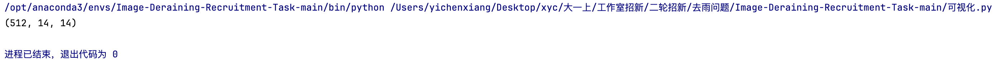
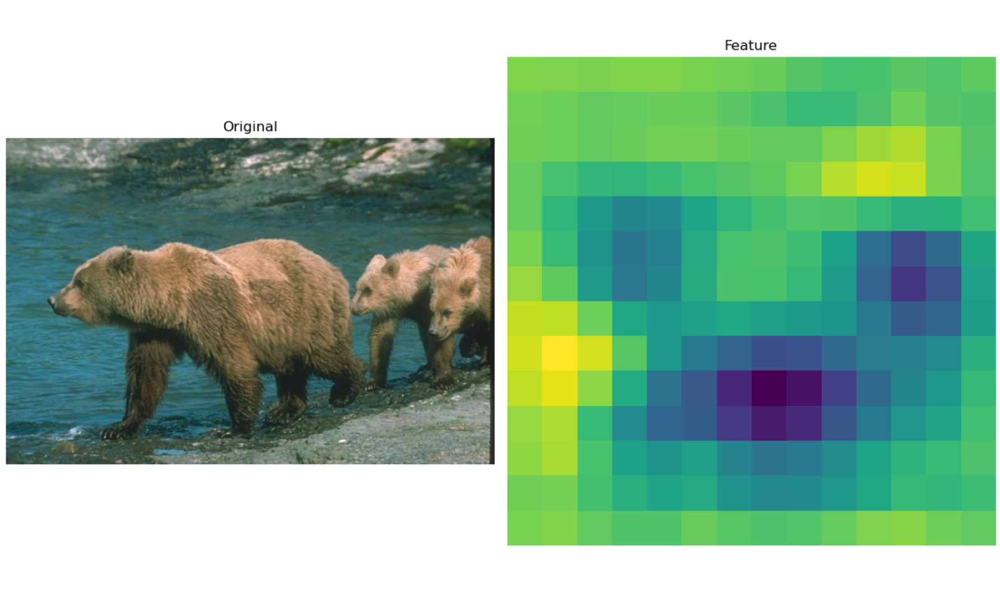
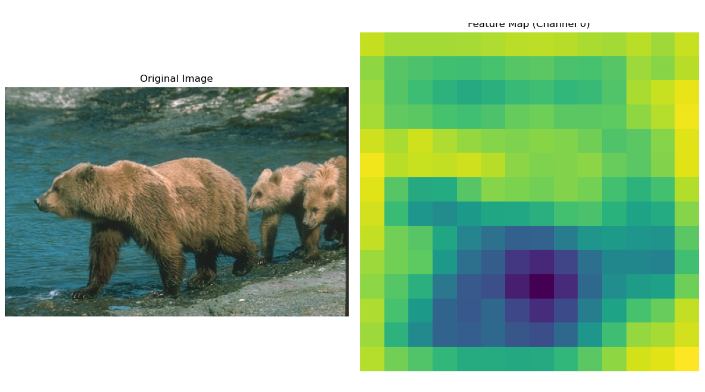
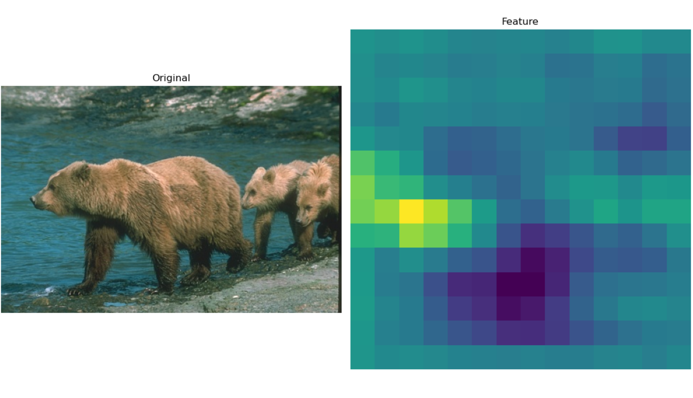
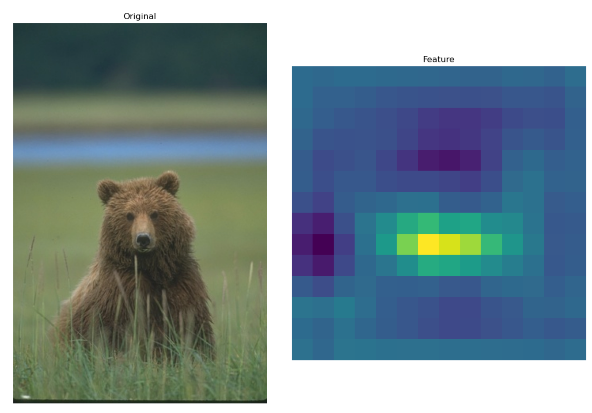
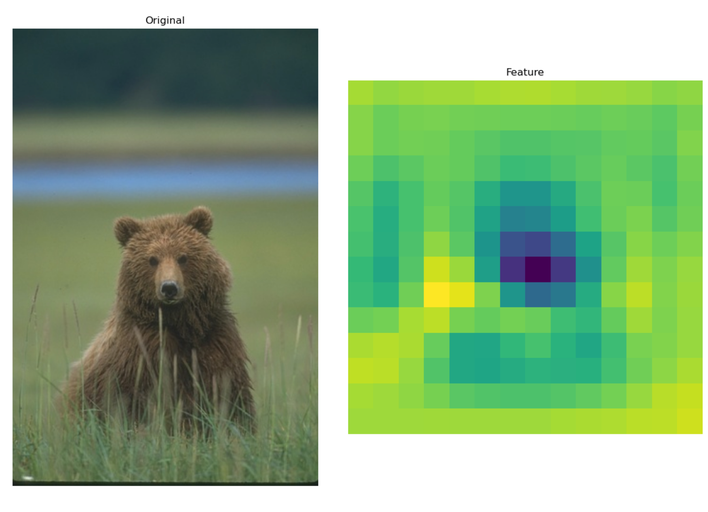
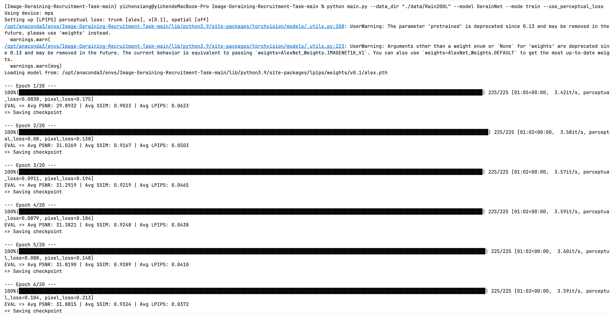
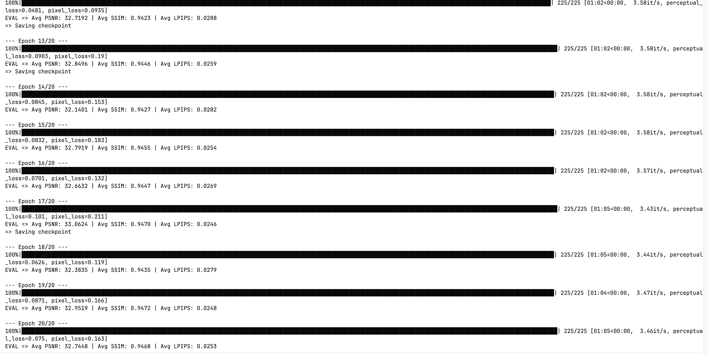

#### 一、

我们都知道，一个卷积网络是有自己的想法的，比如以前所说的训练一个识别车辆的模型，那么越靠近输入层，卷积的识别越关注细节，而越靠近输出层，卷积越关注整体。而我了解到，预训练数据主要来自于人类标注，隐含了人类感知偏好，故当我们用此模型预训练时，模型得到的信息当然也更关注模型的整体，对这样的输出再求损失，损失当然也就更能体现人类所关注的部分。

#### 二、

其实我认为的模型的作用已经在一处给出了回答，现在让我们来可视化一下这个训练结果。

```python
import torch
import torch.nn as nn
from torchvision import models, transforms
from PIL import Image
import matplotlib.pyplot as plt


class VGG19(nn.Module):
    def __init__(self):
        super(VGG19, self).__init__()
        vgg = models.vgg19(weights=models.VGG19_Weights.IMAGENET1K_V1)
        self.features = nn.Sequential(*list(vgg.features.children())[:35])
        for param in self.parameters():
            param.requires_grad = False

    def forward(self, x):
        return self.features(x)


def model_features(image_path):
    device = torch.device('mps' if torch.backends.mps.is_available() else 'cpu')
    transform = transforms.Compose([
        transforms.Resize((224, 224)),
        transforms.ToTensor(),
        transforms.Normalize(mean=[0.485, 0.456, 0.406], std=[0.229, 0.224, 0.225])
    ])
    image = Image.open(image_path).convert('RGB')
    input_tensor = transform(image).unsqueeze(0).to(device)
    model = VGG19().to(device)
    model.eval()

    with torch.no_grad():
        features = model(input_tensor)

    features_np = features.squeeze(0).cpu().numpy()
    visualize(image, features_np)
    return features_np


def visualize(original_image, features):
    fig, axes = plt.subplots(1, 2, figsize=(12, 8))
    axes[0].imshow(original_image)
    axes[0].set_title('Original')
    axes[0].axis('off')
    feature_map = features[2]
    feature_map = (feature_map - feature_map.min()) / (feature_map.max() - feature_map.min())#归一化
    axes[1].imshow(feature_map, cmap='viridis')  #这是一种经典的色彩映射
    axes[1].set_title('Feature')
    axes[1].axis('off')
    plt.tight_layout()
    plt.show()


if __name__ == "__main__":
    image_path = ("./data/Rain200L/train/target/1.png")
    features = model_features(image_path)
    print(features.shape)
```

这是可视化的程序，其输出的features如下



这里我们注意到，此时的输出是一个512维的图片，我们输出其中的几个来看一下











我们可以看出，对于一张图片中，我们越注意到的点，相应的Feature中的点也就越深，也就是说对应的张量中的占比就越大，也就是说子啊loss中越重要，其实就是我们在前面提到的预训练的目的。

#### 三、

训练结果：





### 