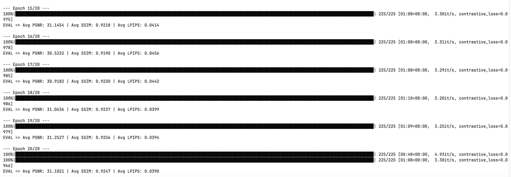

其实1，2是相关的，使用我直接展示修改好的代码。

```python
import torch
import torch.nn as nn
from torchvision.models import vgg19, VGG19_Weights
import torch.nn.functional as F

class EasyContrastiveLoss(nn.Module):
    def __init__(self):
        super(EasyContrastiveLoss, self).__init__()
        vgg = vgg19(weights=VGG19_Weights.IMAGENET1K_V1)
        self.features = nn.Sequential(*list(vgg.features.children())[:35])
        for param in self.parameters():
            param.requires_grad = False
        self.adaptive_pool = nn.AdaptiveAvgPool2d((1, 1))

    def trans_vector(self, x):
        features = self.features(x)
        features = self.adaptive_pool(features).squeeze(-1).squeeze(-1)
        return features

    def forward(self,input,generated, ground_truth):
        input_vector= self.trans_vector(input)
        generated_vector = self.trans_vector(generated)
        ground_truth_vector = self.trans_vector(ground_truth)
        sim_pos = F.cosine_similarity(generated_vector, ground_truth_vector, dim=1)
        sim_neg = F.cosine_similarity(generated_vector, input_vector, dim=1)
        loss = (1 - sim_pos).mean() + sim_neg.mean()
        return loss
```

```python
import torch
import torch.nn as nn
import torch.optim as optim
from torch.utils.data import DataLoader
from tqdm import tqdm
import argparse
import os
import lpips

from dataset import DerainDataset
from utils import calculate_metrics, save_checkpoint, load_checkpoint, save_some_examples
from models.baseline_net import BaselineNet
from models.unet import UNet
from models.Mymodel import Mymodel
from models.DerainNet import DerainNet
from losses.perceptual_loss import PerceptualLoss
from losses.easy_contrastive_loss import EasyContrastiveLoss


def get_args():
    parser = argparse.ArgumentParser(description="Deraining Model Training")
    parser.add_argument("--data_dir", type=str, required=True, help="Path to the dataset")
    parser.add_argument("--model", type=str, default="baseline", choices=["baseline", "unet","DerainNet","Mymodel"], help="Model to use")
    parser.add_argument("--mode", type=str, default="train", choices=["train", "test"], help="Train or test mode")
    parser.add_argument("--checkpoint", type=str, default=None, help="Path to checkpoint for testing")

    parser.add_argument("--epochs", type=int, default=20, help="Number of training epochs")
    parser.add_argument("--batch_size", type=int, default=8, help="Batch size")
    parser.add_argument("--lr", type=float, default=1e-4, help="Learning rate")

    parser.add_argument("--use_perceptual_loss", action="store_true", help="Use perceptual loss")
    parser.add_argument("--use_easy_contrastive_loss", action="store_true", help="Use easy_contrastive loss")
    parser.add_argument("--lambda_pixel", type=float, default=1.0, help="Weight for pixel loss")
    parser.add_argument("--lambda_perceptual", type=float, default=0.1, help="Weight for perceptual loss")
    parser.add_argument("--lambda_contrastive", type=float, default=0.1, help="Weight for contrastive loss")

    return parser.parse_args()


def train_one_epoch(loader, model, optimizer, pixel_loss_fn, perceptual_loss_fn,contrastive_loss_fn, args, device):
    loop = tqdm(loader, leave=True)
    model.train()

    for _, (rainy, clean, _) in enumerate(loop):
        rainy, clean = rainy.to(device), clean.to(device)
        derained = model(rainy)
        pixel_loss = args.lambda_pixel * pixel_loss_fn(derained, clean)
        total_loss = pixel_loss
        if args.use_perceptual_loss:
            p_loss = args.lambda_perceptual * perceptual_loss_fn(derained, clean)
            total_loss += p_loss
            loop.set_postfix(pixel_loss=pixel_loss.item(), perceptual_loss=p_loss.item())
        if args.use_easy_contrastive_loss:
            c_loss = args.lambda_contrastive * contrastive_loss_fn(rainy, derained, clean)
            total_loss += c_loss
            loop.set_postfix(contrastive_loss=c_loss.item())
        else:
            loop.set_postfix(pixel_loss=pixel_loss.item())
        optimizer.zero_grad()
        total_loss.backward()
        optimizer.step()


def evaluate(loader, model, device, lpips_fn):
    model.eval()
    total_psnr, total_ssim, total_lpips = 0, 0, 0

    with torch.no_grad():
        for rainy, clean, _ in loader:
            rainy, clean = rainy.to(device), clean.to(device)
            derained = model(rainy)

            psnr, ssim, lpips_score = calculate_metrics(derained, clean, lpips_fn)
            total_psnr += psnr
            total_ssim += ssim
            total_lpips += lpips_score

    avg_psnr = total_psnr / len(loader)
    avg_ssim = total_ssim / len(loader)
    avg_lpips = total_lpips / len(loader)

    print(f"EVAL => Avg PSNR: {avg_psnr:.4f} | Avg SSIM: {avg_ssim:.4f} | Avg LPIPS: {avg_lpips:.4f}")
    return avg_psnr


def main():
    args = get_args()
    device = "mps" if torch.mps.is_available() else "cpu"
    print(f"Using device: {device}")

    if args.model == "baseline":
        model = BaselineNet().to(device)
    elif args.model == "unet":
        model = UNet().to(device)
    elif args.model == "DerainNet":
        model = DerainNet().to(device)
    elif args.model == "Mymodel":
        model = Mymodel().to(device)


    lpips_fn = lpips.LPIPS(net='alex').to(device)

    pixel_loss_fn = nn.L1Loss()
    perceptual_loss_fn = PerceptualLoss().to(device) if args.use_perceptual_loss else None
    contrastive_loss_fn = EasyContrastiveLoss().to(device) if args.use_easy_contrastive_loss else None
    optimizer = optim.Adam(model.parameters(), lr=args.lr)

    if args.mode == "train":
        train_dataset = DerainDataset(root_dir=args.data_dir, is_train=True)
        train_loader = DataLoader(train_dataset, batch_size=args.batch_size, shuffle=True, num_workers=4)
        test_dataset = DerainDataset(root_dir=args.data_dir, is_train=False)
        test_loader = DataLoader(test_dataset, batch_size=args.batch_size, shuffle=False)

        best_psnr = 0.0
        for epoch in range(args.epochs):
            print(f"\n--- Epoch {epoch + 1}/{args.epochs} ---")
            train_one_epoch(train_loader, model, optimizer, pixel_loss_fn, perceptual_loss_fn,contrastive_loss_fn,args, device)

            current_psnr = evaluate(test_loader, model, device, lpips_fn)

            if current_psnr > best_psnr:
                best_psnr = current_psnr
                checkpoint_data = {"state_dict": model.state_dict(), "optimizer": optimizer.state_dict()}
                model_name_parts = [args.model]
                if args.use_perceptual_loss:
                    model_name_parts.append("perceptual")
                if args.use_easy_contrastive_loss:
                    model_name_parts.append("contrastive")
                model_name = "_".join(model_name_parts) + ".pth.tar"

                save_checkpoint(checkpoint_data, filename=f"best_{model_name}")
                print(f"Saved best model with PSNR: {best_psnr:.4f}")

            save_some_examples(model, test_loader, epoch, folder="evaluation_images", device=device)

    elif args.mode == "test":
        if not args.checkpoint: raise ValueError("Must provide a checkpoint for test mode.")
        load_checkpoint(torch.load(args.checkpoint, map_location=device), model, optimizer)
        test_dataset = DerainDataset(root_dir=args.data_dir, is_train=False)
        test_loader = DataLoader(test_dataset, batch_size=args.batch_size, shuffle=False)

        evaluate(test_loader, model, device, lpips_fn)


if __name__ == "__main__":
    if not os.path.exists("checkpoints"): os.makedirs("checkpoints")
    main()
```




 不过好像确实SSIM比上面一个模型低了