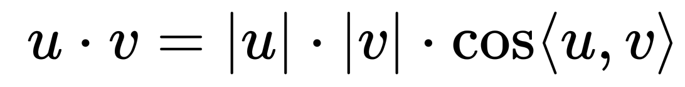

#### 一、

在高中，我们定义的就是有方向和大小的量，这在二维和三维中是很好理解的，我们在高中也学习过，但对于多维向量，我们就要用维度来衡量。如四维向量（a，b，c，d），这些多维向量在ml中其实很常见。有一种说法就是，在python中，张量和向量的区别其实是不大的。

#### 二、

内积有两种定义。最简单的就是代数定义。即

在高中，我们还知道内积还有一种几何含义，即表示一个向量在另一个向量的投影。

#### 三、

余弦相似度这个概念其实我们在风格迁移中已经阐述过了，这里我们直接把当时的阐述copy一下吧

**风格损失通过比较特征统计量（Gram矩阵）来衡量风格相似性。那什么是gram矩阵呢，而为什么内积能表示两个通道间的相似度？这我们就先来回答三个问题。实现gram矩阵通过X·X.T来反映xi和xj的内积，这是简单的矩阵乘法。而我们有知道，内积可以表示为两个向量的模长乘以夹角，在我们认为在不同的通道上两者的模长区别不大，则gram与角度相关，而角度越小，两者的相关性也就越大，故gram可以反映不同的通道（RGB）之间的差异化的大小，进而决定色彩风格的倾向，而预测值和style两者的均方误差就可以反映风格差异了。**

这里我们在总结一下，其实就是用内积除以向量的模长来反映两者的相似度。