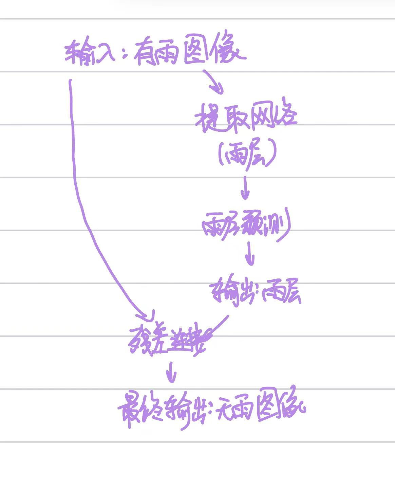
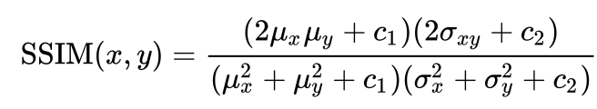
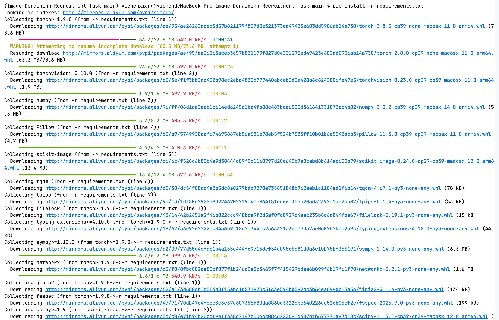
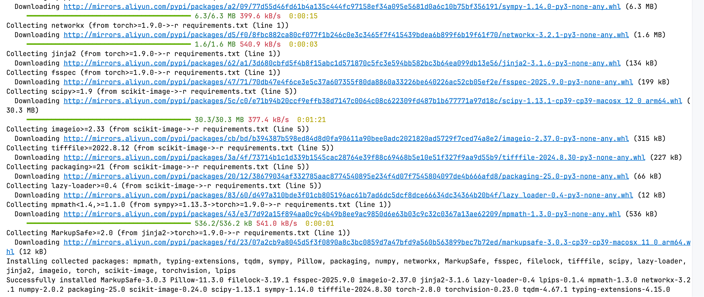
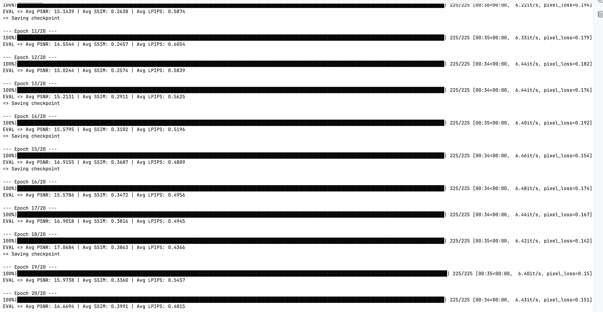
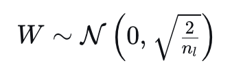
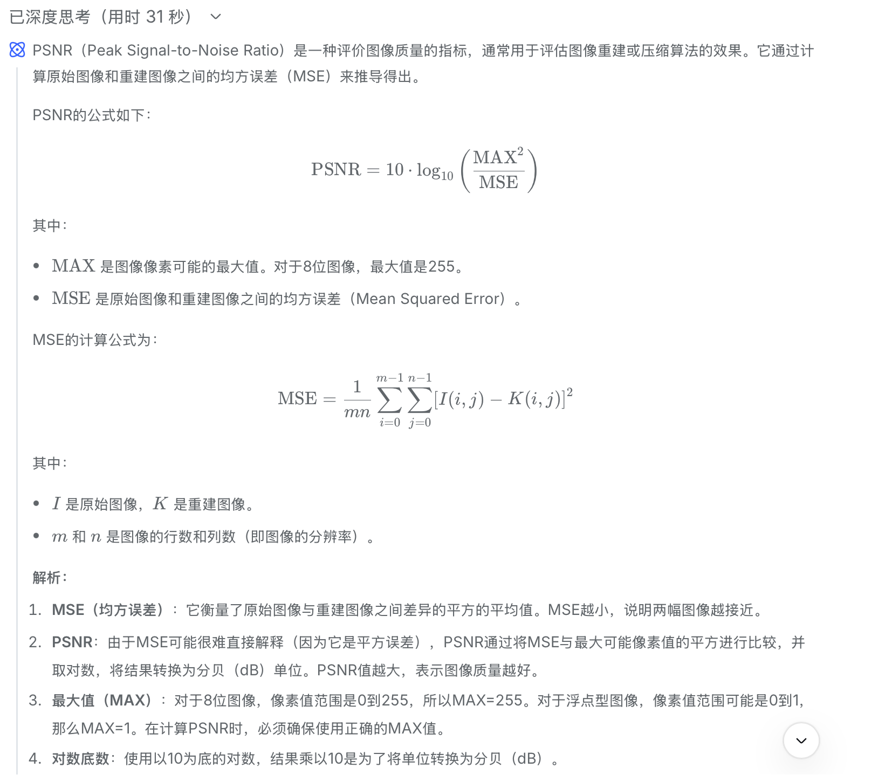
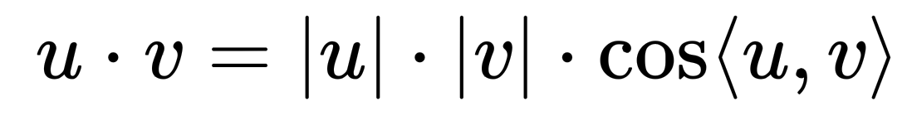
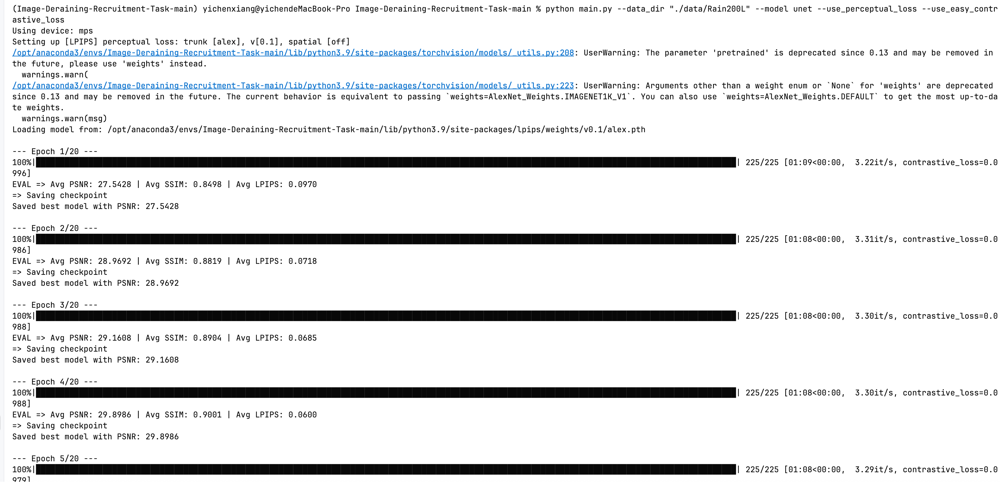
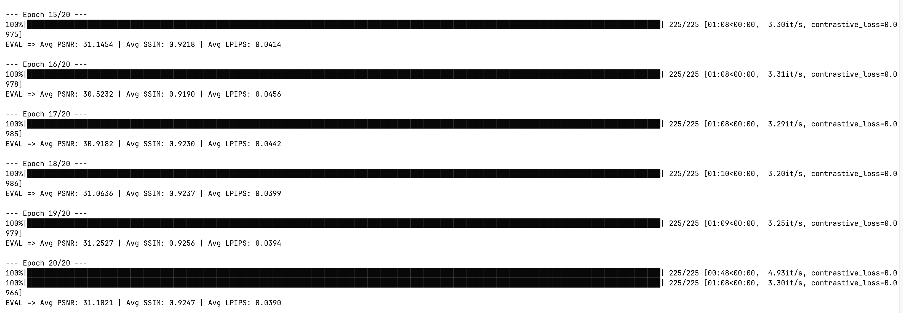

# 图像修复与对比学习：从去雨任务开始

# Part1 先了解一些基础内容

## Task1-无雨 = 有雨 - 雨层 ？

### 基础问题：

**学会从有雨图像到无雨图像的端到端映射**：

这个方法看似比较直接，但这样会有几个问题；一是由于模型学习的是整个画面，同时需要模型记住所有模型的内容，这样既会使得模型的训练难度较大，同时较难收敛，同时由于我们是直接训练得到结果，在没雨的地方内容也可能会发生改变，同时可能会带来很多的噪点。

**残差学习**：

残差学习相对而言只需要我们关注是否存在雨滴即可，这使得模型相对而言更加简单，同时也更容易收敛。这样我们只需要减去这层雨层，对其他地方图像的破坏就会较小。同时学习雨滴的样子而非场景也会带来更多的泛化能力，使得模型更容易推广到更多的场景。

**图像：**



### **附加问题**：

#### 1.雨丝这一物体，在外表上表现出的线性特征，其实也存在于其他物体中（如条纹、纹理等）。在面对这种情况时，**模型如何分辨谁是雨丝？**

其实这是可以区分的，就像我们人可以很明显的区分花纹和真正的雨滴，那么不就说明这两者在视觉上就是有本质区别的。具体而言：

**雨丝**：在整个图像中重复出现，方向分布随机但符合物理规律（透视效果），同时由于运动模糊和光反射，具有特定的亮度渐变和模糊边界

**花纹**：通常局限于特定物体表面（如衣服条纹、建筑纹理），且有清晰的边界和一致的对比度

#### 2.雨非常大时，密集的雨丝可能会完全遮挡住背景的一些细节（比如建筑的轮廓线）。在这种因干扰而难以分辨的情况下，**模型还有可能复原出原来的物体吗？**

我认为有可能，但如果遮挡的过于厉害，有可能也无法完全恢复。首先，我们可以通过海量的数据训练来获得图片的一些规律，比如建筑的轮廓与上下间的关系，建筑上有窗户等等，但如果遮挡关于严重或者该照片的模式我们没有训练，也可能导致信息无法完全修复。

## Task2-怎么优化你的模型？

### 目标函数：

**L1、L2 范数的定义是什么？在几何意义上表示什么意思？**

什么是范数？

这个其实是数学上的概念，简单来说，其定义的函数要满足正定性，绝对齐次性，三角不等式。

L1范数：

L1范数就是对每个Xi的绝对值求合，其在几何意义上表示的就是曼哈顿距离

L2 范数：

L2范数其实就是对Xi的平方求合后再开方，简单来说，其和向量的模长是相似的，其在几何上表示的就是几何距离

**计算过程是怎样的？**

我们可以对真实的无雨图像和我们pred的无雨图像的每个像素点上数据（我们在花卉中得到了表示图像的张量格式——PIL格式）相减，通过L1或者L2来得到损失（同时要取平均），其实我们一般使用的MSE就是基于L2的损失

### 评估指标

#### 1.**PSNR（峰值信噪比）**

峰值信噪比的定义如下：

作为对数分子的，是表示图像点颜色的最大值（如果每个采样点用 8 位表示，就是 255）的平方。对于初学者而言，可以暂时将 	`MAX_I` 理解为一个**固定值**

作为对数分母的，是两张图像在所有像素上的**均方误差 (MSE)** 。MSE 的计算方式源于 L2 范数，这使得 PSNR 指标对异常值（即差异	特别大的像素点）非常敏感（为了笔记的完整，直接copy学长的描述）

#### 2.**SSIM（结构相似性）**

**概述：**

其是一个衡量图片的相似性的一个物理量，他将图片相似性分解到三个通道上：亮度，对比度和结构。让我们先给出SSIM的公式：



在这里，μ表示图像的均值，σ表示方差，σₓᵧ表示协方差。在这里，我没有研究这个函数的具体定义，但我们可以简单感受，当两者的差别越大，SSIM越小，而若两者完全相同，则SSIM为1。

**SSIM 的数值范围是多少？**

SSIM 的数值范围是 [-1, 1]。简单来说，若两幅图片完全相同，则SSIM=1，反之，若完全相反（每个像素点点数值相加为255），此时SSIM=-1。

**SSIM 对图片的考虑主要从哪几个角度？**

主要就是从亮度，对比度和结构三个方面来考虑。

**不同于 PSNR，SSIM 每一次的评估对象是什么？**

**PSNR**的评估对象是整张图片的所有像素。它计算的是所有像素上的均方误差，然后转换成一个分值。它是一个**全局的**评估值。

**SSIM** 的评估对象是图片中的一个局部小窗口。SSIM 算法会用一个滑动窗口在两张图片上逐块移动。在每一个窗口内，分别计算亮度、对比度和结构的相似度，得到一个局部的 SSIM 值。最后，将所有局部窗口的 SSIM 值进行平均，得到一个代表整张图片的最终 SSIM 值。故其实SSIM的过程有点像我们使用卷积并进行池化。

## Task3-任务三：我有说明书，太好啦

### 环境搭建：小菜一碟





###  实现一个简单的模型

#### 1.ResNet的构建

```python
import torch
import torch.nn as nn
import torch.nn.functional as F


class ResidualBlock(nn.Module):
    def __init__(self, in_channels=64, out_channels=64, stride=1):
        super(ResidualBlock, self).__init__()

        self.conv1 = nn.Conv2d(in_channels, out_channels, kernel_size=3,
                               stride=stride, padding=1, bias=False)
        self.bn1 = nn.BatchNorm2d(out_channels)

        self.conv2 = nn.Conv2d(out_channels, out_channels, kernel_size=3,
                               stride=1, padding=1, bias=False)
        self.bn2 = nn.BatchNorm2d(out_channels)
        self.shortcut = nn.Sequential()
    def forward(self, x):
        out = F.relu(self.bn1(self.conv1(x)))
        out = self.bn2(self.conv2(out))
        out += self.shortcut(x)
        out = F.relu(out)
        return out


class BaselineNet(nn.Module):
    def __init__(self, in_channels=3, out_channels=3, base_channels=64):
        super(BaselineNet, self).__init__()

        self.conv1 = nn.Conv2d(in_channels, base_channels, kernel_size=3,
                               stride=1, padding=1, bias=False)
        self.bn1 = nn.BatchNorm2d(base_channels)

        self.layer1 = ResidualBlock(base_channels, base_channels, stride=1)
        self.layer2 = ResidualBlock(base_channels, base_channels, stride=1)
        self.layer3 = ResidualBlock(base_channels, base_channels, stride=1)
        self.layer4 = ResidualBlock(base_channels, base_channels, stride=1)

        self.conv_final = nn.Conv2d(base_channels, out_channels, kernel_size=3,
                                    stride=1, padding=1)

        self._initialize_weights()

    def _initialize_weights(self):
        for m in self.modules():
            if isinstance(m, nn.Conv2d):
                nn.init.kaiming_normal_(m.weight, mode='fan_out', nonlinearity='relu')
            elif isinstance(m, nn.BatchNorm2d):
                nn.init.constant_(m.weight, 1)
                nn.init.constant_(m.bias, 0)

    def forward(self, x):
        identity = x

        out = F.relu(self.bn1(self.conv1(x)))
        out = self.layer1(out)
        out = self.layer2(out)
        out = self.layer3(out)
        out = self.layer4(out)
        out = self.conv_final(out)

        output = identity + out
        return output
```

#### 2.解决感受野受限的问题

让我们先来介绍几个概念。

##### 空洞卷积：

它通过在卷积核元素之间插入空格（空洞）来**扩大感受野**，同时**不增加参数数量**或**降低分辨率**。简单来说，它就是先通过加入0的方式扩大整个卷积核，但由于0的位置不改变整个结构，所以实际的卷积核的大小是不变的

##### 金字塔池化 ：

相比传统的池化，金字塔池化通过多个并行池化分支，由此可以捕获从精细到粗糙的多尺度信息，从而扩大了感受野并且在一定程度上有助于减小过拟合。

### 这个代码是什么意思？

#### 运行代码截图：



但我们注意到，此时的SSIM并不高，只有0.39左右，但同时我们注意到此时的loss已经稳定在0.15,甚至出现了一定的过拟合，这也为我们在下文留下了契机。

#### 学到的新东西：

Resnet的整体结构我在花卉那道题中基本已经阐述了，但这道题中学到的一个有趣的东西反而是下面的初始化的方式。

```python
def _initialize_weights(self):
    for m in self.modules():
        if isinstance(m, nn.Conv2d):
            nn.init.kaiming_normal_(m.weight, mode='fan_out', nonlinearity='relu')
        elif isinstance(m, nn.BatchNorm2d):
            nn.init.constant_(m.weight, 1)
            nn.init.constant_(m.bias, 0)
```

以前，我们初始化都是求合为0和方差为1来来初始化w，并直接将b赋值为0，这当然是对的。但在这里，我们使用使用 **Kaiming正态分布**来初始化权重。这是一种对于CNN更好的初始化方式。具体而言，其正态分布如下



相比于我们以前使用的状态分布，其最主要的区别就是它将方差从不变的1改变为一个与岑层数有关，这样使得网络结构（fan_in或fan_out）自动调整方差，使得每一层激活值的方差大致为1，从而保持信号在深层网络中的稳定流动。同时系数2是因为ReLU会将一半的输入置零，所以方差会减半，而我们可以通过乘2来补偿这一损失。

#### 附加：

对于手动实现，我们首先要了解PSNR的公式，这里我直接询问deepseek，得到了如下的结果。



故我们要遍历整个图片来计算MSE，同时在遍历的同时要寻找MAX，最终由第一个公式就可以计算PSNR。同时，我们主要到，如果我们对图片进行了归一化，那么此时max就应为1。

```python
def my_psnr(img1, img2):
    mse = np.mean((img1 - img2) ** 2)
    if img1.dtype == np.uint8:
        max = 255.0
    elif img1.max() <= 1.0 and img2.max() <= 1.0:
        max = 1.0
    else:
        max = max(np.max(img1), np.max(img2))
    psnr = 20 * math.log10(max / math.sqrt(mse))
    return psnr
```

# Part2 优化我们的算法

## Part2.1-首先成为搭积木高手

### Task1-搞了半天原来要自己写

完整版见python文件，主要修改如下：

#### 一、

```python
parser.add_argument("--model", type=str, default="baseline", choices=["baseline", "unet","DerainNet","Mymodel"], help="Model to use")
```

#### 二、

```python
import torch
import torch.nn.functional as F
from torch import nn


class DerainNet(nn.Module):
    def __init__(self):
        super(DerainNet, self).__init__()
        pass
    def forward(self, x):
        pass
```

```python
from models.baseline_net import BaselineNet
from models.unet import UNet
from models.Mymodel import Mymodel
from models.DerainNet import DerainNet
from losses.perceptual_loss import PerceptualLoss
```

#### 三、

```python
def main():
    args = get_args()
    device = "mps" if torch.mps.is_available() else "cpu"
    print(f"Using device: {device}")

    if args.model == "baseline":
        model = BaselineNet().to(device)
    elif args.model == "unet":
        model = UNet().to(device)
    elif args.model == "DerainNet":
        model = DerainNet().to(device)
    elif args.model == "Mymodel":
        model = Mymodel().to(device)
```

### Task2-试试看前人的杰作

#### 1.代码：

```python
import torch
from torch import nn


class ResidualBlock(nn.Module):
    def __init__(self, channels):
        super(ResidualBlock, self).__init__()
        self.conv1 = nn.Conv2d(channels, channels, kernel_size=3, padding=1)
        self.relu = nn.ReLU(inplace=True)
        self.conv2 = nn.Conv2d(channels, channels, kernel_size=3, padding=1)

    def forward(self, x):
        residual = x
        out = self.relu(self.conv1(x))
        out = self.conv2(out)
        out += residual
        return out


class DerainNet(nn.Module):
    def __init__(self, in_channels=3, base_channels=64, num_blocks=8):
        super(DerainNet, self).__init__()
        self.initial_conv = nn.Conv2d(in_channels, base_channels, kernel_size=3, padding=1)

        self.branch_full = self.Blocks(base_channels, num_blocks)
        self.branch_half = self.Blocks(base_channels, num_blocks)
        self.branch_quarter = self.Blocks(base_channels, num_blocks)

        self.pool_half = nn.MaxPool2d(kernel_size=2, stride=2)
        self.pool_quarter = nn.MaxPool2d(kernel_size=4, stride=4)

        self.upsample_half = nn.Upsample(scale_factor=2, mode='bilinear', align_corners=False)
        self.upsample_quarter = nn.Upsample(scale_factor=4, mode='bilinear', align_corners=False)

        self.trans= nn.Sequential(
            nn.Conv2d(base_channels * 3, base_channels, kernel_size=3, padding=1),
            nn.ReLU(inplace=True),
            nn.Conv2d(base_channels, in_channels, kernel_size=3, padding=1)
        )

    def Blocks(self, channels, num_blocks):   #将前面我们写的8层残差块封装在一个函数中
        layers = []
        for _ in range(num_blocks):
            layers.append(ResidualBlock(channels))
        return nn.Sequential(*layers)

    def forward(self, x):
        x_initial = self.initial_conv(x)

        branch1_out = self.branch_full(x_initial) + x_initial

        x_half = self.pool_half(x_initial)
        branch2_out = self.branch_half(x_half) + x_half
        branch2_out = self.upsample_half(branch2_out)

        x_quarter = self.pool_quarter(x_initial)
        branch3_out = self.branch_quarter(x_quarter) + x_quarter
        branch3_out = self.upsample_quarter(branch3_out)

        concatenated = torch.cat([branch1_out, branch2_out, branch3_out], dim=1)
        rain_layer = self.trans(concatenated)
        deraining = x - rain_layer
        return deraining
```

#### 2.测试模型性能：


#### 3.思考：

##### 1.

下采样在上面的模型中就是池化，本质就是减少图像面积来获得更大的感受野，而上采样就是Upsimple（关于其的细节我写在了下面），其本质就是增加图像或特征图的空间尺寸，来获得更多的细节。

首先下采样的原因应该就是为了解决感受野的问题，下采样可以让图片获得更大的感受野的同时也就一定程度上减小了计算量，避免了梯度爆炸或者是梯度消失的可能。而上采样的原因我认为是为了保持图片大小的一致性，毕竟去雨任务的本质就是输出一个与原图片大小相同的新图片。同时也使得三者的图像可以拼接。这样分为三个尺度采样也使得模型可以对不同大小的雨分开处理。

Concat本质就是在特定的维度上组合张量的过程。具体来说，在上面的例子中，其就是沿着C这个维度组合张量，最后将其变为3C

##### 2.

**关于Upsimple：**

这个函数（方法）确实我是第一次听说，简单来说它是是 PyTorch 中用于上采样（放大）特征图的模块，可以将小尺寸的特征图放大到更大的尺寸。其实在我看来Upsimple与maxpool就是一对相对而言的方法，后者将图像压缩从而可以获得更大的感受野，后者将图片恢复到原有的大小来恢复图片的整体形状。

##### 一些小的思考（以下观点纯属个人猜测😊）：

其实我在研究这个方法的时候，我想到的是花卉那道题。在那道题目中，我们使用裁切的数据增强方式得到了3组图片，让后我把三组图片用torch.cat的方式扩大了3倍，然后代入训练，但后面我们也注意这样做会带来一定程度的过拟合。而我们裁切的主要目的不也是为了后去不同的大小（感受野），那我们用这个方法不是也可以使得花卉的训练效果更好。

## Part2.2

### Task1-基于像素到底有什么不好？

#### 一、

我们都知道，一个卷积网络是有自己的想法的，比如以前所说的训练一个识别车辆的模型，那么越靠近输入层，卷积的识别越关注细节，而越靠近输出层，卷积越关注整体。而我了解到，预训练数据主要来自于人类标注，隐含了人类感知偏好，故当我们用此模型预训练时，模型得到的信息当然也更关注模型的整体，对这样的输出再求损失，损失当然也就更能体现人类所关注的部分。

#### 二、

其实我认为的模型的作用已经在一处给出了回答，现在让我们来可视化一下这个训练结果。

```python
import torch
import torch.nn as nn
from torchvision import models, transforms
from PIL import Image
import matplotlib.pyplot as plt


class VGG19(nn.Module):
    def __init__(self):
        super(VGG19, self).__init__()
        vgg = models.vgg19(weights=models.VGG19_Weights.IMAGENET1K_V1)
        self.features = nn.Sequential(*list(vgg.features.children())[:35])
        for param in self.parameters():
            param.requires_grad = False

    def forward(self, x):
        return self.features(x)


def model_features(image_path):
    device = torch.device('mps' if torch.backends.mps.is_available() else 'cpu')
    transform = transforms.Compose([
        transforms.Resize((224, 224)),
        transforms.ToTensor(),
        transforms.Normalize(mean=[0.485, 0.456, 0.406], std=[0.229, 0.224, 0.225])
    ])
    image = Image.open(image_path).convert('RGB')
    input_tensor = transform(image).unsqueeze(0).to(device)
    model = VGG19().to(device)
    model.eval()

    with torch.no_grad():
        features = model(input_tensor)

    features_np = features.squeeze(0).cpu().numpy()
    visualize(image, features_np)
    return features_np


def visualize(original_image, features):
    fig, axes = plt.subplots(1, 2, figsize=(12, 8))
    axes[0].imshow(original_image)
    axes[0].set_title('Original')
    axes[0].axis('off')
    feature_map = features[2]
    feature_map = (feature_map - feature_map.min()) / (feature_map.max() - feature_map.min())#归一化
    axes[1].imshow(feature_map, cmap='viridis')  #这是一种经典的色彩映射
    axes[1].set_title('Feature')
    axes[1].axis('off')
    plt.tight_layout()
    plt.show()


if __name__ == "__main__":
    image_path = ("./data/Rain200L/train/target/1.png")
    features = model_features(image_path)
    print(features.shape)
```

这是可视化的程序，其输出的features如下


这里我们注意到，此时的输出是一个512维的图片，我们输出其中的几个来看一下


我们可以看出，对于一张图片中，我们越注意到的点，相应的Feature中的点也就越深，也就是说对应的张量中的占比就越大，也就是说子啊loss中越重要，其实就是我们在前面提到的预训练的目的。

#### 三、

训练结果：


### Task2-你知道什么是向量吗？

#### 一、

在高中，我们定义的就是有方向和大小的量，这在二维和三维中是很好理解的，我们在高中也学习过，但对于多维向量，我们就要用维度来衡量。如四维向量（a，b，c，d），这些多维向量在ml中其实很常见。有一种说法就是，在python中，张量和向量的区别其实是不大的。

#### 二、

内积有两种定义。最简单的就是代数定义。即



在高中，我们还知道内积还有一种几何含义，即表示一个向量在另一个向量的投影。

#### 三、

余弦相似度这个概念其实我们在风格迁移中已经阐述过了，这里我们直接把当时的阐述copy一下吧

**风格损失通过比较特征统计量（Gram矩阵）来衡量风格相似性。那什么是gram矩阵呢，而为什么内积能表示两个通道间的相似度？这我们就先来回答三个问题。实现gram矩阵通过X·X.T来反映xi和xj的内积，这是简单的矩阵乘法。而我们有知道，内积可以表示为两个向量的模长乘以夹角，在我们认为在不同的通道上两者的模长区别不大，则gram与角度相关，而角度越小，两者的相关性也就越大，故gram可以反映不同的通道（RGB）之间的差异化的大小，进而决定色彩风格的倾向，而预测值和style两者的均方误差就可以反映风格差异了。**

这里我们在总结一下，其实就是用内积除以向量的模长来反映两者的相似度。

### Task3-改造感知损失函数，使用特征做对比

其实1，2是相关的，使用我直接展示修改好的代码。

```python
import torch
import torch.nn as nn
from torchvision.models import vgg19, VGG19_Weights
import torch.nn.functional as F

class EasyContrastiveLoss(nn.Module):
    def __init__(self):
        super(EasyContrastiveLoss, self).__init__()
        vgg = vgg19(weights=VGG19_Weights.IMAGENET1K_V1)
        self.features = nn.Sequential(*list(vgg.features.children())[:35])
        for param in self.parameters():
            param.requires_grad = False
        self.adaptive_pool = nn.AdaptiveAvgPool2d((1, 1))

    def trans_vector(self, x):
        features = self.features(x)
        features = self.adaptive_pool(features).squeeze(-1).squeeze(-1)
        return features

    def forward(self,input,generated, ground_truth):
        input_vector= self.trans_vector(input)
        generated_vector = self.trans_vector(generated)
        ground_truth_vector = self.trans_vector(ground_truth)
        sim_pos = F.cosine_similarity(generated_vector, ground_truth_vector, dim=1)
        sim_neg = F.cosine_similarity(generated_vector, input_vector, dim=1)
        loss = (1 - sim_pos).mean() + sim_neg.mean()
        return loss
```

```python
import torch
import torch.nn as nn
import torch.optim as optim
from torch.utils.data import DataLoader
from tqdm import tqdm
import argparse
import os
import lpips

from dataset import DerainDataset
from utils import calculate_metrics, save_checkpoint, load_checkpoint, save_some_examples
from models.baseline_net import BaselineNet
from models.unet import UNet
from models.Mymodel import Mymodel
from models.DerainNet import DerainNet
from losses.perceptual_loss import PerceptualLoss
from losses.easy_contrastive_loss import EasyContrastiveLoss


def get_args():
    parser = argparse.ArgumentParser(description="Deraining Model Training")
    parser.add_argument("--data_dir", type=str, required=True, help="Path to the dataset")
    parser.add_argument("--model", type=str, default="baseline", choices=["baseline", "unet","DerainNet","Mymodel"], help="Model to use")
    parser.add_argument("--mode", type=str, default="train", choices=["train", "test"], help="Train or test mode")
    parser.add_argument("--checkpoint", type=str, default=None, help="Path to checkpoint for testing")

    parser.add_argument("--epochs", type=int, default=20, help="Number of training epochs")
    parser.add_argument("--batch_size", type=int, default=8, help="Batch size")
    parser.add_argument("--lr", type=float, default=1e-4, help="Learning rate")

    parser.add_argument("--use_perceptual_loss", action="store_true", help="Use perceptual loss")
    parser.add_argument("--use_easy_contrastive_loss", action="store_true", help="Use easy_contrastive loss")
    parser.add_argument("--lambda_pixel", type=float, default=1.0, help="Weight for pixel loss")
    parser.add_argument("--lambda_perceptual", type=float, default=0.1, help="Weight for perceptual loss")
    parser.add_argument("--lambda_contrastive", type=float, default=0.1, help="Weight for contrastive loss")

    return parser.parse_args()


def train_one_epoch(loader, model, optimizer, pixel_loss_fn, perceptual_loss_fn,contrastive_loss_fn, args, device):
    loop = tqdm(loader, leave=True)
    model.train()

    for _, (rainy, clean, _) in enumerate(loop):
        rainy, clean = rainy.to(device), clean.to(device)
        derained = model(rainy)
        pixel_loss = args.lambda_pixel * pixel_loss_fn(derained, clean)
        total_loss = pixel_loss
        if args.use_perceptual_loss:
            p_loss = args.lambda_perceptual * perceptual_loss_fn(derained, clean)
            total_loss += p_loss
            loop.set_postfix(pixel_loss=pixel_loss.item(), perceptual_loss=p_loss.item())
        if args.use_easy_contrastive_loss:
            c_loss = args.lambda_contrastive * contrastive_loss_fn(rainy, derained, clean)
            total_loss += c_loss
            loop.set_postfix(contrastive_loss=c_loss.item())
        else:
            loop.set_postfix(pixel_loss=pixel_loss.item())
        optimizer.zero_grad()
        total_loss.backward()
        optimizer.step()


def evaluate(loader, model, device, lpips_fn):
    model.eval()
    total_psnr, total_ssim, total_lpips = 0, 0, 0

    with torch.no_grad():
        for rainy, clean, _ in loader:
            rainy, clean = rainy.to(device), clean.to(device)
            derained = model(rainy)

            psnr, ssim, lpips_score = calculate_metrics(derained, clean, lpips_fn)
            total_psnr += psnr
            total_ssim += ssim
            total_lpips += lpips_score

    avg_psnr = total_psnr / len(loader)
    avg_ssim = total_ssim / len(loader)
    avg_lpips = total_lpips / len(loader)

    print(f"EVAL => Avg PSNR: {avg_psnr:.4f} | Avg SSIM: {avg_ssim:.4f} | Avg LPIPS: {avg_lpips:.4f}")
    return avg_psnr


def main():
    args = get_args()
    device = "mps" if torch.mps.is_available() else "cpu"
    print(f"Using device: {device}")

    if args.model == "baseline":
        model = BaselineNet().to(device)
    elif args.model == "unet":
        model = UNet().to(device)
    elif args.model == "DerainNet":
        model = DerainNet().to(device)
    elif args.model == "Mymodel":
        model = Mymodel().to(device)


    lpips_fn = lpips.LPIPS(net='alex').to(device)

    pixel_loss_fn = nn.L1Loss()
    perceptual_loss_fn = PerceptualLoss().to(device) if args.use_perceptual_loss else None
    contrastive_loss_fn = EasyContrastiveLoss().to(device) if args.use_easy_contrastive_loss else None
    optimizer = optim.Adam(model.parameters(), lr=args.lr)

    if args.mode == "train":
        train_dataset = DerainDataset(root_dir=args.data_dir, is_train=True)
        train_loader = DataLoader(train_dataset, batch_size=args.batch_size, shuffle=True, num_workers=4)
        test_dataset = DerainDataset(root_dir=args.data_dir, is_train=False)
        test_loader = DataLoader(test_dataset, batch_size=args.batch_size, shuffle=False)

        best_psnr = 0.0
        for epoch in range(args.epochs):
            print(f"\n--- Epoch {epoch + 1}/{args.epochs} ---")
            train_one_epoch(train_loader, model, optimizer, pixel_loss_fn, perceptual_loss_fn,contrastive_loss_fn,args, device)

            current_psnr = evaluate(test_loader, model, device, lpips_fn)

            if current_psnr > best_psnr:
                best_psnr = current_psnr
                checkpoint_data = {"state_dict": model.state_dict(), "optimizer": optimizer.state_dict()}
                model_name_parts = [args.model]
                if args.use_perceptual_loss:
                    model_name_parts.append("perceptual")
                if args.use_easy_contrastive_loss:
                    model_name_parts.append("contrastive")
                model_name = "_".join(model_name_parts) + ".pth.tar"

                save_checkpoint(checkpoint_data, filename=f"best_{model_name}")
                print(f"Saved best model with PSNR: {best_psnr:.4f}")

            save_some_examples(model, test_loader, epoch, folder="evaluation_images", device=device)

    elif args.mode == "test":
        if not args.checkpoint: raise ValueError("Must provide a checkpoint for test mode.")
        load_checkpoint(torch.load(args.checkpoint, map_location=device), model, optimizer)
        test_dataset = DerainDataset(root_dir=args.data_dir, is_train=False)
        test_loader = DataLoader(test_dataset, batch_size=args.batch_size, shuffle=False)

        evaluate(test_loader, model, device, lpips_fn)


if __name__ == "__main__":
    if not os.path.exists("checkpoints"): os.makedirs("checkpoints")
    main()
```





 不过好像确实SSIM比上面一个模型低了
